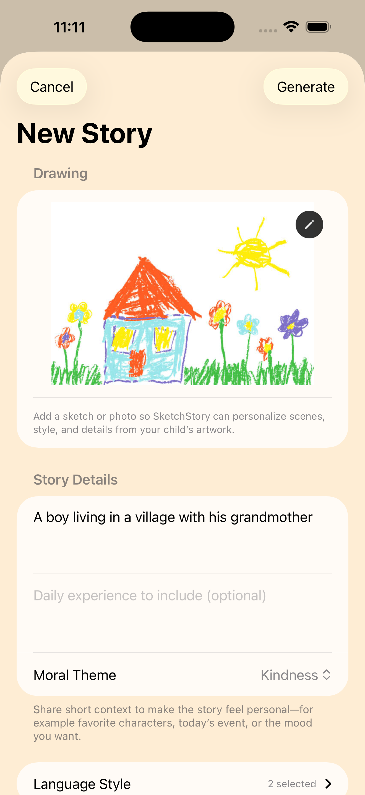

# SketchStory

SketchStory is a storytelling app that helps parents turn prompts and drawings into kid-friendly stories.
It uses on-device Apple Intelligence capabilities for text and image understanding while keeping content local to the device.


[](https://apps.apple.com/in/app/sketchstory/id6762089588)

SketchStory is now published on the Mac App Store:
https://apps.apple.com/in/app/sketchstory/id6762089588

## Highlights

- On-device story creation from custom prompts
- Drawing and image-based story inspiration using Visual Intelligence flows
- Child profile personalization for more relevant stories
- Read modes for comfort (scroll and page-flip)
- Local storage with reset controls for generated data
- Privacy-first experience with no account requirement

## Core Screens

| Create | Story Preview | Story Library |
| --- | --- | --- |
|  |  |  |

## Tech Stack

- SwiftUI
- Apple Intelligence related frameworks (on supported devices)
- Local persistence via UserDefaults
- Lottie and VariableBlur packages

## Availability

- Platform: Mac App Store
- Listing: https://apps.apple.com/in/app/sketchstory/id6762089588

## Privacy and Support

- Privacy Policy: https://ebullioscopic.github.io/SketchStory/
- Contact Page: https://ebullioscopic.github.io/SketchStory/contact.html

## Build and Run

### Requirements

- Xcode 16+
- iOS Simulator or iOS device with supported OS version

### Command Line Build

```bash
xcodebuild -project SketchStory.xcodeproj -scheme SketchStory -configuration Debug -destination 'generic/platform=iOS Simulator' build CODE_SIGNING_ALLOWED=NO
```

## Project Structure

```
SketchStory/
    SketchStory/                 # App source files
    SketchStory.xcodeproj/       # Xcode project
    .github/assets/              # Screenshots and branding assets
    docs/                        # GitHub Pages site (privacy + contact)
```

## Author

Hariharan Mudaliar

- Website: https://tinyurl.com/hariharanmudaliar
- LinkedIn: https://linkedin.com/in/hariharan-mudaliar
- Email: hrhn.mudaliar251@gmail.com
- GitHub: https://github.com/Ebullioscopic
- Phone: +91 9429199029

## License and Usage

This repository is provided strictly for reference and transparency purposes.

- You may view the source code for personal and informational purposes only.
- You may not copy, reproduce, modify, redistribute, or create derivative works from this code.
- You may not use this code in commercial or non-commercial projects.

See [LICENSE](LICENSE) for full terms.

